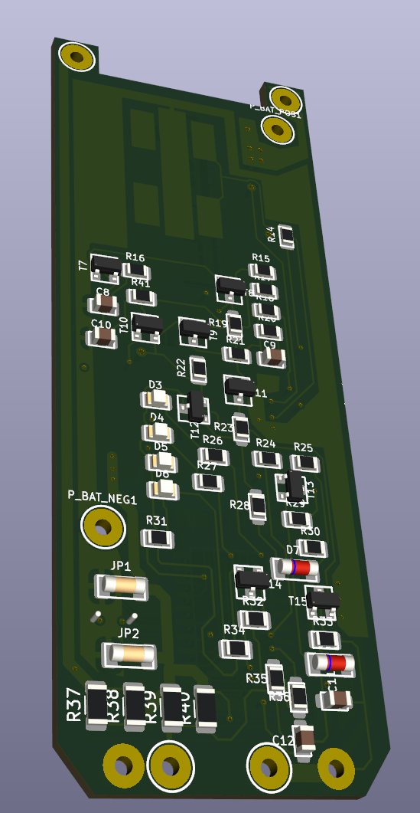
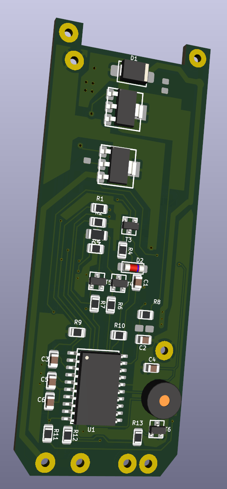

# Moser ChromStyle Pro 1871 – rekonštrukcia PCB a schémy

Reverzné inžinierstvo dosky strihacieho strojčeka **Moser/Wahl 1871-7176**, PCB **E190688**, s mikrokontrolérom **ATtiny461V-10SU**.

## Aktuálne súbory

- [Moser_1871_FINAL_3D_SYNC1.kicad_pcb](Moser_1871_FINAL_3D_SYNC1.kicad_pcb) – aktuálna ručne rekonštruovaná PCB; hlavný zdroj pravdy projektu.
- [Moser_1871_FINAL_3D_SYNC1.kicad_sch](Moser_1871_FINAL_3D_SYNC1.kicad_sch) – schéma odvodená z PCB.

PCB a schéma majú rovnaký základ názvu, aby ich bolo možné zaradiť do jedného projektu KiCad 9. Lokálny projektový súbor `.kicad_pro` je možné vytvoriť alebo ponechať v rovnakom priečinku.

## 3D náhľad dosky

### Predná strana – F.Cu

### Zadná strana – B.Cu

## Zásadné pravidlo rekonštrukcie

Pri rozpore platí toto poradie dôveryhodnosti:

1. meranie a sledovanie spojov na originálnej PCB,
2. čitateľná fotografia originálnej dosky,
3. aktuálny ručne opravený PCB súbor,
4. datasheet jednoznačne identifikovanej súčiastky,
5. staré automatické siete, staré schémy a odhady podľa markingu.

Geometria používateľovej PCB je nadradená. Cesty, zóny, polohy, orientácie ani číslovanie plôšok sa nemajú automaticky meniť. Schéma je rekonštrukcia z PCB, nie autorita nad originálnou doskou.

## Potvrdené tranzistory

| Marking | Typ | Tranzistory | Pinout |
|---|---|---|---|
| FZT968 | FZT968 PNP, SOT-223 | T1, T2 | 1=B, 2=C/tab, 3=E |
| 6CW | BC817-40 NPN, SOT-23 | T4, T5, T6, T13, T15 | 1=B, 2=E, 3=C |
| 1K / 1.K | BC848B NPN, SOT-23 | T3, T11 | 1=B, 2=E, 3=C |
| 3.B | BC856B PNP, SOT-23 | T8, T9, T12, T14 | 1=B, 2=E, 3=C |

Tieto identifikácie sú v KiCad súboroch označené ako **POTVRDENÉ – NEMENIŤ**.

### T7

- marking **HDY0**,
- digitálny tranzistor/BRT potvrdený,
- presný katalógový typ a vnútorné rezistory zatiaľ nepotvrdené,
- aktuálne PCB: T7.1 = N012, T7.2 = GND, T7.3 = N010.

### T10

- marking **P8W** a zvislé číslo **67**,
- digitálny tranzistor/BRT potvrdený,
- presný katalógový typ a vnútorné rezistory zatiaľ nepotvrdené,
- T10.1 = Adapter+,
- T10.2 = BAT+,
- T10.3 = R16.2.

Staré identifikácie T10 ako PMBZ5246B a definitívne tvrdenie PDTC143ET sa nepovažujú za potvrdené.

## Diódy a indikácia

### D1 – ochrana motora

- marking **S4**,
- vpravo je anóda,
- vľavo je katóda,
- aktuálne číslovanie: 1=A, 2=K,
- funkcia ochrannej/flyback diódy motora je potvrdená,
- presný katalógový typ zostáva otvorený; SS24-class je iba pracovný kandidát.

### LED stavu batérie

- D3, D4 a D5 sú zelené LED indikácie nabitia,
- D6 je červená LED nízkeho/vybitého stavu,
- pin 1 = anóda, pin 2 = katóda,
- LED sú ovládané cez katódové vetvy.

Potvrdené väzby:

- D3.2 → R26.1; R26.2 → U1.12,
- D4.2 → R27.1; R27.2 → U1.3,
- D5.2 → R31.2; R31.1 → U1.8,
- D6.2 → R34.1 → R32.1; R32.2 → T14.1.

## Potvrdené merania

- motor: približne **530 mA pri 4 V**,
- akumulátor: **3,6 V / 2000 mAh**, externý test približne **1700 mAh a 6,2 Wh pri 300 mA**,
- automatické vypnutie motora nastalo približne pri **2,885–2,888 V**,
- R37–R40: marking R100, hodnota **0,100 Ω**,
- R41: **0,30 Ω**,
- JP1 a JP2: nulové MELF prepojky, DCR približne **6 mΩ**, indukčnosť pod **0,1 µH**.

## Podpora projektu

Ak vám táto rekonštrukcia pomohla alebo ste jej podklady použili, budeme radi, ak projektu udelíte aspoň **⭐ hviezdičku na GitHube**. Je to jednoduchý spôsob, ako oceniť čas, merania na originálnej PCB a našu spoločnú prácu vloženú do rekonštrukcie.

## Aktuálna pracovná etapa

Dopĺňajú sa kontrolné plôšky **TP**. Každý TP sa najprv vytvorí a pripojí v schéme, následne sa cez aktualizáciu zo schémy prenesie do PCB a umiestni na fyzickú kontrolnú plôšku alebo koniec príslušného prekovu.

Projekt je stále pracovná rekonštrukcia a zatiaľ nie je určený ako výrobný podklad.
